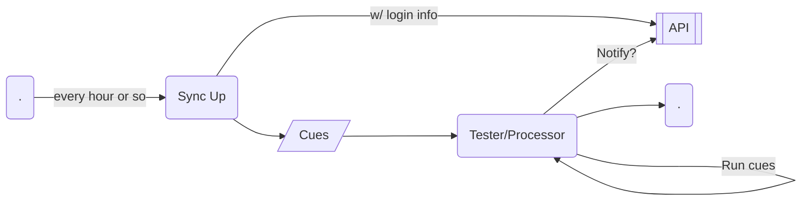

## 06/28/2021 - Catching up

### Sync up and daemons and crons...

* Install daemon/cron to run every hour or so. This daemon will be to sync up with server.
* Another daemon/"process" will actually run the checks/cues locally.

Diagram:

